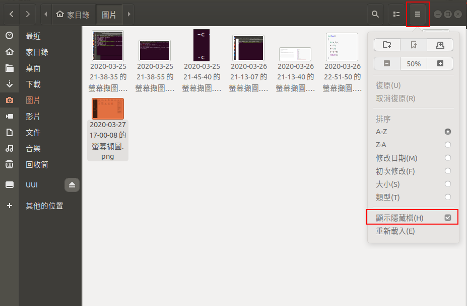
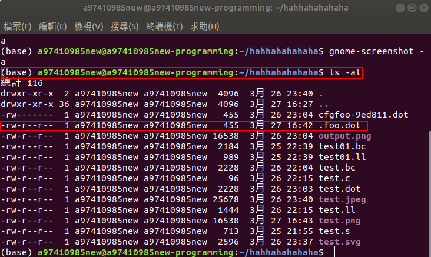
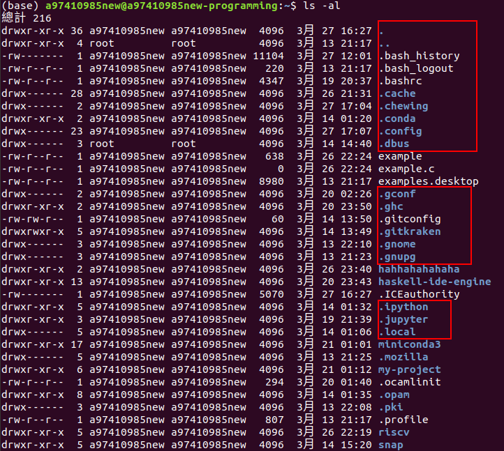

[TOC]

# linux相關作業系統的小問題

## 明明有產生檔案但看不到檔案

那是因為有些檔案是隱藏的，可能是一些系統設定檔之類的東西，出現了會很亂

1. 圖形界面要怎麼樣才看得到檔案

   就打開檔案總管，點擊『三條線的圖示』跑出跟檔案顯示相關的選單，然後勾選『顯示隱藏檔』

   

2. 如何下指令能看到隱藏的檔案

   

3. 隱藏的檔案有什麼特徵

   檔名的開頭是小數點

   

